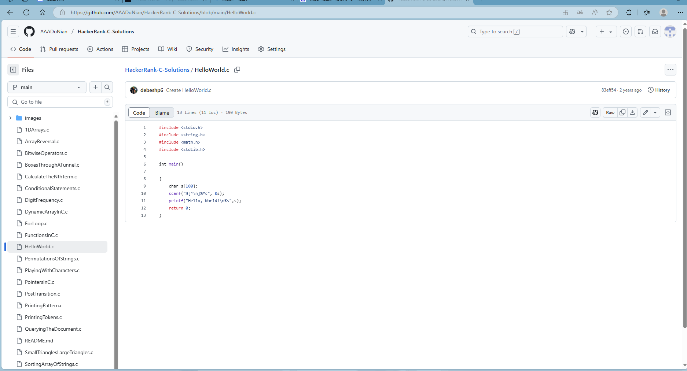
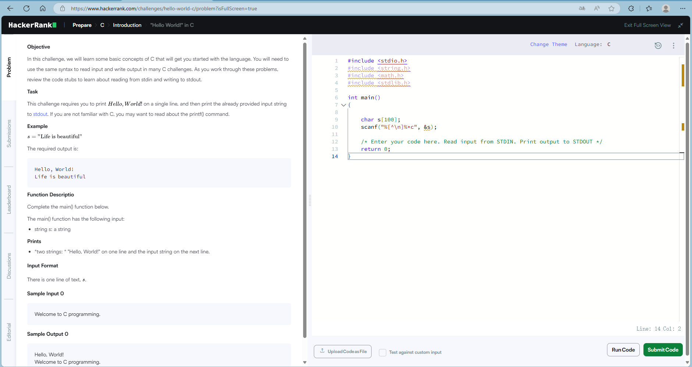
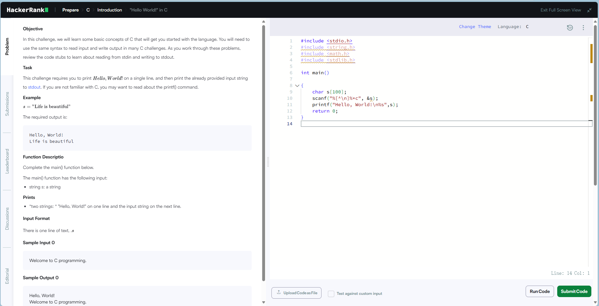
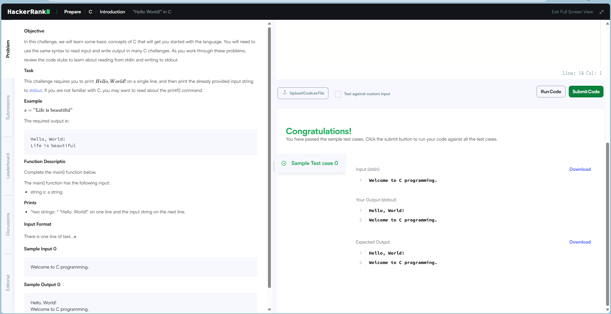

# HackerRank C 解决方案

我们在这里汇集了来自HackerRank编码平台的C编程挑战参考解决方案。欢迎所有爱好者自由探索，并提供更好的解决方案!

# ✨ 项目特点

- 👏 代码含完整I/O处理逻辑，可直接提交验证
- 👆  每个文件单独对应解决一个问题
- 💤 可以直接复制粘贴到 HackerRank 上，不需要额外环境。
- 💓 开源，并且支持协作解决问题

# 🚀 快速开始 🔥

## 克隆储存库

1.点击下面的图标立即克隆此代码库:
- [](https://github.com/debeshp6/HackerRank-C-Solutions)

2.另外，你也可以点击这个链接:(https://github.com/debeshp6/HackerRank-C-Solutions)

## 使用储存库

1.克隆了之后, 在一个浏览器新标签页打开 HackerRank 的下面的链接,完成注册并登录
- (https://www.hackerrank.com/domains/c)

2.在存储库中,查找任何选定问题的相应参考解决方案
 <!-- by 何嘉伟 -->

# 🗂️ 项目结构     

```
HackerRank-C-Solutions/
├── Solutions/            #解决方案
│   ├── HelloWorld.c      #"Hello World!" in C
│   ├── PlayingWithCharacters.c      #字符操作
│   ├── SumAndDifferenceOfTwoNum.c   #两数之和与差
│   ├── FunctionsInC.c    #C中的函数
│   ├── PointersInC.c     # C中的指针
│   └── ...
├── images/               #项目截图
│   ├── 1.png             
│   ├── 2.png
│   ├── 3.png
│   └── 4.png              
├──  README.md
└──  README.zh.md
```

# 🎉主要功能和截图

- 主要功能性‌：此仓库收集了来自HackerRank的C编程挑战参考解决方案。

- 截图如下 

- 
- 
- 
- 
 <!-- by 何嘉伟 -->
 
# 👋 友好提示

## 📌 分享与鸣谢

- 这些解决方案遵循麻省理工学院（MIT）开源许可协议（可免费使用！），但请保留原作者的注释。
- 请勿在此分享 HackerRank 的付费 / 高级问题的答案。
- 如果你采用了他人的方法，请在代码注释中附上链接并提及原作者。

## 📌 编码理念

我们优先考虑代码的可读性，而非追求巧妙：
- ✅ 使用标准库函数
- ✅ 变量命名应像 “student_count” 这样，而不是 “n”。
- ✅ 将代码分解为符合逻辑的模块
- 🚫 避免使用特定平台的技巧
- 🚫 不要使用魔法数字，应使用在问题中解释过的常量

 <!-- by 陈永兴 -->

 ## 🛠️ 当出现问题时

1.检查 HackerRank 是否最近更新了问题

2.再次检查你的输入格式是否与要求完全一致

3.查找并删除任何遗留的调试打印语句

4.如果仍然卡住了？请提交问题报告，内容包括：
- 问题的 URL
- 错误消息截图
- 哪个测试失败了

# 👍 想提供意见吗？

如果你有更好的解决方案或提交全新的解决方案，步骤如下：

- 复刻此代码库
- 创建一个新分支
- 提交你的更改
- 发起拉取请求

我们欢迎你展示本领！ ✨

# 🤝 联系我们
- [](https://github.com/debeshp6)

祝你编码愉快！ 🚀
<!-- by 陈永兴 -->